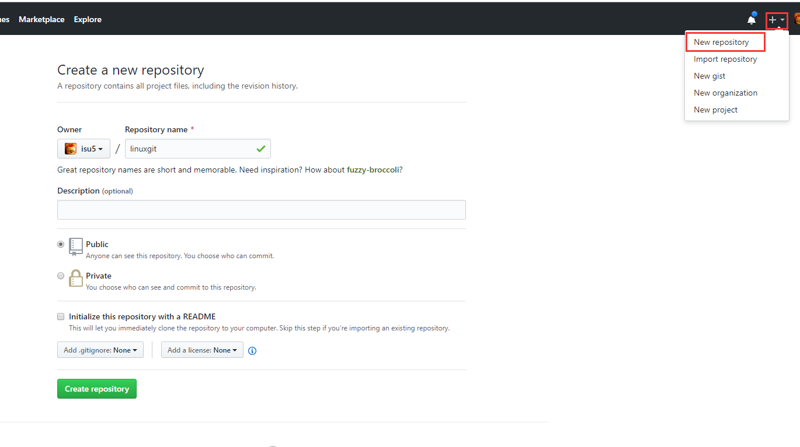
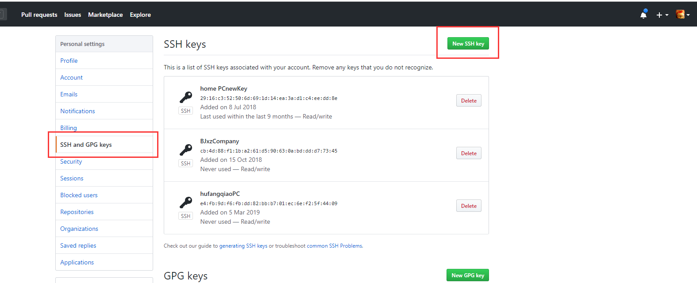

#### git全局配置
```
git config --global user.email 'xxx@126.com'
git config --global user.name 'isu5cn'
```
#### 将代码推向两个版本库gitee和github
```
首先使用克隆命令 在一个版本库中克隆一个项目:

git clone https://gitee.com/isu5cn/linuxnote.git

这时,如果提交修改或者新增的文件,就是在码云gitee版本库中

同时提交到github里边,在克隆完后就直接配置

git remote set-url --add origin https://github.com/isu5/linuxnote.git

在项目目录右键使用Git Bash Here
cd .git

vim config

可以查看到以下代码:

[remote "origin"]
        url = https://gitee.com/isu5cn/linuxnote.git
        fetch = +refs/heads/*:refs/remotes/origin/*
        url = https://github.com/isu5/linuxnote.git
		
这样,提交版本的时候,就会同时传入两个git版本库平台
```
#### 常用

1. 初始化新仓库 `git init`
2. 克隆旧仓库 `git clone https://github.com/isu5/linuxnote.git`
3. 查看状态 `git status`
4. 提交单个文件 `git add index.php`
5. 提交所有文件 `git add -A`
6. 使用通配符提交 `git add *.js`
7. 提交到仓库中 `git commit -m '提示信息'`
8. 提交已经跟踪过的文件，不需要执行`add git commit -a -m '提交信息'`
9. 删除版本库与项目目录中的文件 `git rm index.php`
10. 只删除版本库中文件但保存项目目录中文件`git rm --cached index.php`
11. 修改最后一次提交 `git commit --amend`

#### 清理

1. 放弃没有提交的修改 `git checkout .`
2. 删除没有add 的文件和目录 `git clean -fd`
3. 显示将要删除的文件或目录 `git clean -n`

#### Log

1. 查看日志 `git log`
2. 查看最近2次提交日志并显示文件差异 `git log -p -2`
3. 显示已修改的文件清单 `git log --name-only`
4. 显示新增、修改、删除的文件清单 `git log --name-status`
5. 一行显示并只显示SHA-1的前几个字符 `git log --oneline`

#### Alias

通过创建命令别名可以减少命令输入量。
```
git config --global alias.c commit
```

可以在配置文件 ~/.gitconfig 中查看或直接编辑

下面是一个Git命令Alias配置
```
[alias]
    a = add .
    c = commit
    s = status
    l = log
    b = branch
```

现在可以使用 git a 实现 git add . 一样的效果了。

系统Alias

在 ~/.bash_profile 文件中定义
```
alias gs="git status"
alias gc="git commit -m "
alias gl="git log --graph --pretty=format:'%Cred%h%Creset -%C(yellow)%d%Creset %s %Cgreen(%cr) %C(bold blue)<%an>%Creset' --abbrev-commit  "
alias gb="git branch"
alias ga="git add ."
alias go="git checkout"
```

命令行直接使用 `gs` 即可以实现 `git status` 一样的效果了。

window 系统需要使用 `git for window` 中的 `Git Base` 软件

#### .gitignore

.gitignore用于定义忽略提交的文件

1. 所有空行或者以注释符号 ＃ 开头的行都会被 Git 忽略。
2. 匹配模式最后跟反斜杠（/）说明要忽略的是目录。
3. 可以使用标准的 glob 模式匹配。
```
.idea
/vendor
.env
/node_modules
/public/storage
*.txt
```

#### 分支 Branch

分支用于为项目增加新功能或修复Bug时使用。

1. 创建分支 git branch dev
2. 查看分支 git branch
3. 切换分支 git checkout dev
4. 创建并切换分支 git checkout -b feature/bbs
5. 合并dev分支到master
```
git checkout master
git merge dev
```

6. 删除分支 git branch -d dev
7. 删除没有合并的分支git branch -D dev
8. 删除远程分支 git push origin :dev
9. 查看未合并的分支(切换到master) git branch --no-merged
10. 查看已经合并的分支(切换到master) git branch --merged

#### 冲突

不同分修改同一个文件或不同开发者修改同一个分支文件都可能造成冲突，造成无法提交代码。

使用编辑器修改冲突的文件
添加暂存 `git add . `表示已经解决冲突
git commit 提交完成

#### 储藏（Stashing）

当你正在进行项目中某一部分的工作，里面的东西处于一个比较杂乱的状态，而你想转到其他分支上进行一些工作。问题是，你不想提交进行了一半的工作，否则以后你无法回到这个工作点。

"暂存" 可以获取你工作目录的中间状态——也就是你修改过的被追踪的文件和暂存的变更——并将它保存到一个未完结变更的堆栈中，随时可以重新应用。

1. 储藏工作 `git stash`
2. 查看储藏列表 `git stash list`
3. 应用最近的储藏 `git stash apply`
4. 应用更早的储藏 `git stash apply stash@{2}`
5. 删除储藏 `git stash drop stash@{0}`
6. 应用并删除储藏 `git stash pop`

#### Tag

Git 也可以对某一时间点上的版本打上标签 ，用于发布软件版本如 v1.0

1. 添加标签 `git tag v1.0`
2. 列出标签 `git tag`
3. 推送标签 `git push --tags`
4. 删除标签 `git tag -d v1.0.1`
5. 删除远程标签 `git push origin :v1.0.1`

#### 发布

对mster分支代码生成压缩包供使用者下载使用，--prefix 指定目录名
```
git archive master --prefix='linuxnote/' --format=zip > linuxnote.zip
```

#### 远程仓库
下面是最热的`Github`进行讲解，使用`码云、codeing` 等国内仓库使用方式一致，就不在赘述了。

> 创建仓库

为了完成以下示例，你需要在GitHub 创建好仓库。


#### SSH

> 生成秘钥

使用ssh连接Github发送指令更加安全可靠，也可以免掉每次输入密码的困扰。

在命令行中输入以下代码（windows用户使用 Git Bash）
```
ssh-keygen -t rsa
```

一直按回车键直到结束。系统会在~/.ssh 目录中生成 id_rsa和id_rsa.pub，即密钥id_rsa和公钥id_rsa.pub。

#### 向GitHub添加秘钥


点击 New SSH key 按钮，添加上面生成的 id_rsa.pub 公钥内容。

#### windows下git 如何避免每次push都要输入用户名和密码
本地环境：git bash windows版
右键打开 git bash here
```
cd ~
vi .gitconfig
```
在文件中加上如下：
```
[credential] 
helper = store
```
这样就可以解决了



