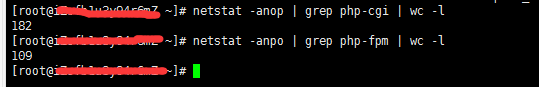
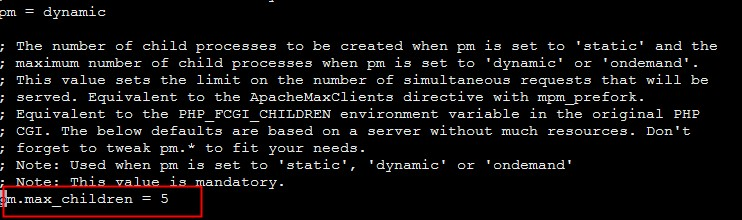
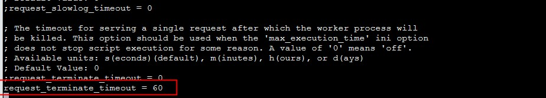
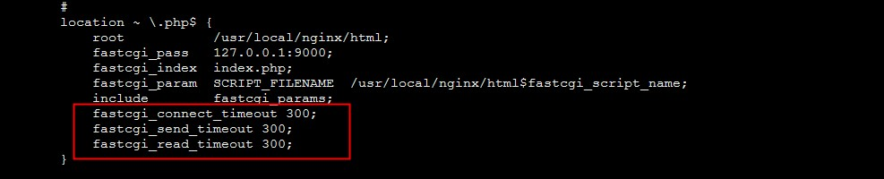

### nginx环境 无法访问 网站打不开 502 bad gateway问题的解决方法

Nginx 502 Bad Gateway的含义是请求的PHP-CGI已经执行，但是由于某种原因（一般是读取资源的问题）没有执行完毕而导致PHP-CGI进程终止，一般来说Nginx 502 Bad Gateway和php-fpm.conf的设置有关。

常见的原因可能是php-cgi进程数不够用、php执行时间长（mysql慢）、或者是php-cgi进程死掉，都会出现502错误。

> 1. 在安装好的环境中，运行一段时间出现502问题，一般是因为默认php-cgi进程是5个，可能因为phpcgi进程不够用而造成502，需要修改/usr/local/php/etc/php-fpm.conf 将其中的max_children值适当增加。

> 2. php执行超时，修改/usr/local/php/etc/php.ini (找相应的php.ini位置)将max_execution_time 改为1000 (尽可能大点)

> 3. 磁盘空间不足，可以使用 # df -h命令查看磁盘使用量

> 4. php-cgi进程死掉了。

通常的排查方法如下：

#### 1、查看php fastcgi的进程数（max_children值）
```
# netstat -anop | grep php-cgi | wc -l
# netstat -anpo | grep php-fpm | wc -l
```


#### 2、查看当前进程
```
# ps aux | grep php-fpm //观察fastcgi/php-fpm进程数,假如使用的进程数等于或高于5个，说明需要增加
```

#### 3、调整/usr/local/php/etc/php-fpm.conf 的相关设置
```
pm.max_children = 5
request_terminate_timeout = 60
```



max_children最多5个进程，按照每个进程20MB内存，最多100MB。也就是1分钟。max_children增多，则php-cgi的进程多了就会处理的很快，排队的请求就会很少。 但是设置max_children也需要根据服务器的性能进行设定，一般来说一台服务器正常情况下每一个php-cgi所耗费的内存在20M左右。根据自己服务器购买的内存来实际决定。
request_terminate_timeout执行的时间为60秒，request_terminate_timeout值可以根据服务器的性能进行设定。一般来说性能越好你可以设置越高，20分钟-30分钟都可以。

#### 4、部分PHP程序的执行时间超过了Nginx的等待时间，可以适当增加nginx.conf配置文件中FastCGI的timeout时间，例如：
```
http
{
……
fastcgi_connect_timeout 300;
fastcgi_send_timeout 300;
fastcgi_read_timeout 300;
……
}
```




